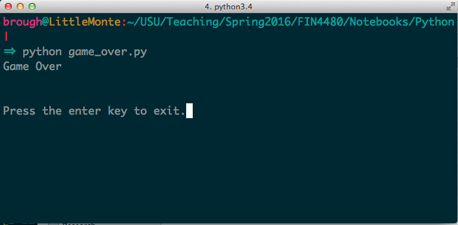

### Finance 4480
**Spring 2016** 
**Basic Python** 

# Writing a *Very* Simple First Program: The Game Over Program

Let's write a super simple program that gives the following output when it runs:



The code to do this in `Python` is very simple:


```python
print("Game Over")
input("\n\nPress the enter key to exit.")
```

    Game Over
    
    
    Press the enter key to exit.


    ''


We can write this in a `Python` script as follows:

~~~python
# Game Over
# Demonstrates the use of the print and input functions
print("Game Over")
input("\n\nPress the enter key to exit.")
~~~

For example, we could use a text editor (like the one built into the Syder IDE) and
save the file as *game_over.py*

This simple code demonstrates a few things:

- The use of comments with the `#` character. Anything on a line after a `#` is ignored by `Python`.
- The use of the builtin function `print` to disply information to the console.
- The use of the builtin function `input` to get information from the user into the program.
- The use of string literals such as `"Game Over"`.
- Top level code. This basically means `Python` statements executed one after another in a text file.
- Syntax highlighting of keywords such as `print` and `input`. These are reserved words in the `Python` syntax.

When this code is executed we get the output like in the picture above.

As our codes become more complex we will want to make sure they remain manageable and easy to use. We will introduce some structure to do that. It won't be obvious at first how this helps, but as our codes grow more complex this will be good practice that will protect us and keep things manageable.

We have seen how to use builtin functions like `print` and `input`. `Python` allows to write our own. 

One function that we will write for each script will be the `main` function. This is a way to mimic the `main` function in other programming languages like `C/C++`, `C#`, and `Java`. 

Defining a new function is very simple. We just use the `def` keyword as follows. Let's say we want to write a simple function that adds two integers together and returns the result. We could do this with the following code:


```python
def addTwo(x, y):
    value = x + y
    return value
```

Then we can call the new function like this:


```python
addTwo(6, 9)
```


    15


So we can write some simple functions to help us structure our codes. Let's see how we might do this for the *Game Over* program:


```python
## This is a silly redudent function, but gives you the idea of a worker function that the main
## function can farm work out to
def printMessage(message):
    print(message)

## The main function is the brains of the program, where it all happens. Like the command and
## control center
def main():
    message = "Game Over"
    printMessage(message)
    input("\n\nPress the enter key to exit.")
    
## Call to main - from where it actually runs (i.e. top level code)
main()
```

    Game Over
    
    
    Press the enter key to exit.


For this super simple program it seems like overkill. But trust me: you will soon see how this will help you as your codes get even moderately complex. It will allow you to keep a mental map to help you organize and plan out your codes. 

## References

These notes are based off of Chapter 1 from the excellent book:

[Python Programming for the Absolute Beginner 3rd Edition](http://goo.gl/Rqw9Qv)
